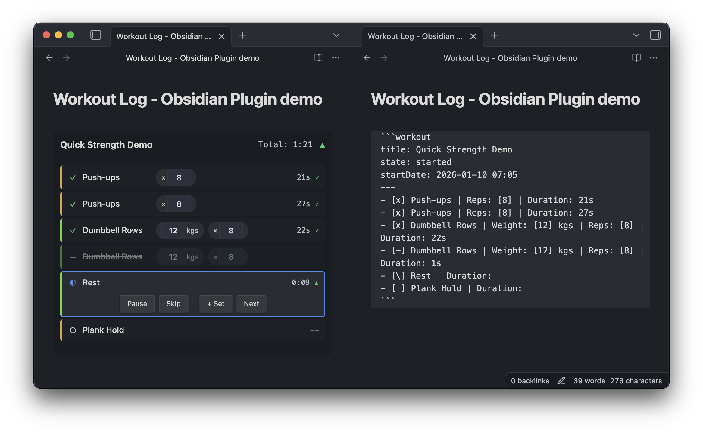
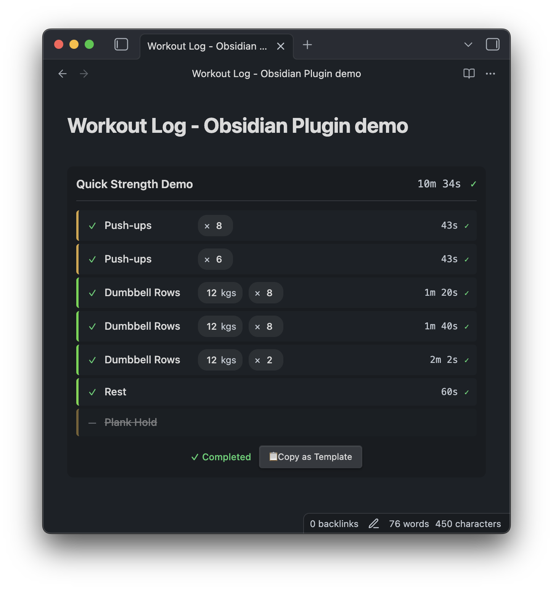

# Life Log

An Obsidian plugin for tracking **study sessions** and **workouts** with interactive timers, self-evaluation, and AI-friendly data export.

## Overview

Track your daily learning and fitness activities directly in Obsidian. All data is stored as plain markdown - easy to analyze with AI, backup, and own forever.


## Features

### 📚 Study Log (New in v2.0!)
- **Subject-based tracking**: Organize by Math, English, Programming, or custom subjects
- **Study timers**: Count-up for free study, countdown for timed goals
- **Self-evaluation**: Rate your focus and comprehension (1-5 stars)
- **AI-friendly data**: YAML frontmatter for easy analysis with Claude/GPT

### 🏋️ Workout Log
- **Timer modes**: Count-up for exercises, countdown for rest periods with auto-advance
- **Editable values**: Click to edit weight, reps, or duration during tracking
- **Add Set / Add Rest**: Quickly add extra sets or rest periods on the fly
- **Skip / Pause / Resume**: Full control over your workout flow

### 🎯 Common Features
- **Quick Log Modal**: Create new logs with `Ctrl/Cmd + Shift + L`
- **Ribbon Icon**: One-click access from sidebar
- **Auto-save**: Records saved to dated files in your chosen folder
- **Copy as Template**: Reuse completed logs as templates
- **Mobile-friendly**: Touch-optimized UI

## Installation

### Using BRAT (Recommended)
1. Install [BRAT](https://github.com/TfTHacker/obsidian42-brat) from Community Plugins
2. Open BRAT settings → "Add Beta plugin"
3. Enter: `https://github.com/reallygood83/life-log`
4. Enable the plugin in Community Plugins

### Manual Installation
1. Download `main.js`, `manifest.json`, and `styles.css` from [latest release](https://github.com/reallygood83/life-log/releases)
2. Create folder: `<vault>/.obsidian/plugins/life-log/`
3. Copy files into the folder
4. Enable plugin in Obsidian settings

## Usage

### Quick Start
1. Press `Ctrl/Cmd + Shift + L` or click the Life Log ribbon icon
2. Choose "Study" or "Workout" tab
3. Configure your session and click Create
4. Start tracking!

### Study Log Format

````markdown
```study-log
title: 오후 학습
subject: 수학
state: planned
---
- [ ] 미적분 Chapter 3 복습 | Duration: [45m]
- [ ] 연습문제 풀이 | Duration: [30m]
```
````

### Workout Log Format

````markdown
```life-log
title: Morning Workout
state: planned
restDuration: 60s
---
- [ ] Squats | Weight: [60] kg | Reps: [10]
- [ ] Rest | Duration: [60s]
- [ ] Bench Press | Weight: [40] kg | Reps: [8]
```
````

### Metadata Fields

#### Study Log
| Field | Description |
|-------|-------------|
| `title` | Session name |
| `subject` | Subject/topic |
| `state` | `planned`, `started`, `completed` |
| `startDate` | Auto-filled on start |
| `endDate` | Auto-filled on completion |
| `totalDuration` | Total study time |
| `focusScore` | Self-evaluation 1-5 |
| `comprehensionScore` | Self-evaluation 1-5 |
| `tags` | Comma-separated tags |

#### Workout Log
| Field | Description |
|-------|-------------|
| `title` | Workout name |
| `state` | `planned`, `started`, `completed` |
| `startDate` | Auto-filled on start |
| `duration` | Total workout time |
| `restDuration` | Default rest duration |

### Task/Exercise Format

```
- [ ] Item Name | Key: [value] unit | Key: value
```

- `[ ]` pending, `[\]` in progress, `[x]` completed, `[-]` skipped
- `[value]` = editable, `value` = locked
- `Duration: [60s]` = countdown timer

## Settings

Access via Settings → Life Log:

- **Save folder**: Where logs are saved (default: `Life Logs`)
- **Date format**: File naming format
- **Subjects**: Customize subject presets
- **Pomodoro mode**: Enable 25/5 work/break cycles
- **Default rest duration**: For workouts
- **Timer sounds**: Audio notifications
- **Ribbon icon**: Show/hide sidebar icon

## AI Analysis

Study logs include YAML frontmatter for easy AI analysis:

```markdown
---
type: study-log
date: 2026-01-15
subject: 수학
totalDuration: 150
focusScore: 4
comprehensionScore: 4
---
```

**Example prompts:**
- "Analyze my Life Logs folder and show weekly study time by subject"
- "What's my average focus score for Programming sessions?"
- "Create a monthly report of my study habits"

## Screenshots

### Study Log


### Workout Log


## Building from Source

```bash
npm install
npm run build    # Production build
npm run dev      # Watch mode
```

## Changelog

### v2.0.0
- **NEW**: Study Log feature with subject tracking and self-evaluation
- **NEW**: Quick Log Modal (`Ctrl/Cmd + Shift + L`)
- **NEW**: Settings panel with subject customization
- **NEW**: Auto file creation in dated folders
- **NEW**: YAML frontmatter for AI analysis
- **NEW**: Ribbon icon for quick access

### v1.0.0
- Initial release with workout tracking

## License

MIT
